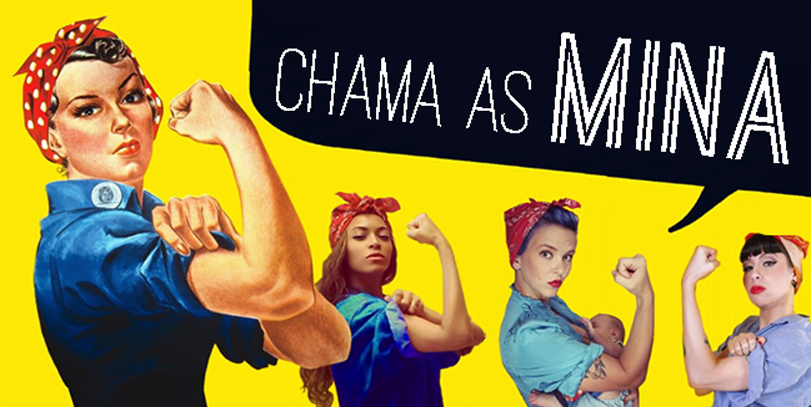

# Chama as Mina

## Introdução
  O projeto Rede Social foi desenvolvido para o bootcamp da Laboratória pelas alunas Esthéfanie Vila Maior, Iana Neri e Rebeca Borges. O objetivo é criar uma plataforma responsiva, que lê e grava dados através do firebase, utilizando JavaScript(ES6), HTML, CSS, jQuery e Bootstrap, além de seguir os princípios de UX e cultura ágil.

#### Organização do projeto:
  Foram utilizados princípios da cultura ágil, criando um backlog baseado nas histórias dos usuários.
* Planejamento: (https://trello.com/b/NKFJxdVN/rede-social)

## Funcionalidades
  Funcionalidades Implementadas:  
  **- Sign Up:** criação de conta com e-mail, Facebook e Google  
  **- Sign In:** login com e-mail, Facebook e Google  
  **- Timeline:** postar como público/privado, excluir, editar, filtrar por público/privado, e curtir.  
  **- Perfil:** criar perfil com dados como profissão, nome completo, cidade e estado, data de nascimento e @usuário. 

## Definição do produto
  "Chama as Mina" é uma rede social destinada para mulheres que buscam por serviços e produtos, também para aquelas que desejam divulgar seu trabalho e conseguir novos clientes. O objetivo da plataforma é facilitar o contato entre as usuárias e promover a valorização e incentivo do trabalho feminino.

## Experiência de Usuário (UX Design)
  Através das entrevistas realizadas foi possível entender as necessidades das usuárias. Elas são mulheres que utilizam redes sociais e costumam contratar serviços ou adquirir produtos pela internet, porém elas se sentiriam mais seguras se esses serviços fossem oferecidos por outras mulheres. Elas também demonstram interesse em apoiar o trabalho feminino.

#### Personas:
  Foram criadas duas personas: Betina e Maria.

### Entrevistas com usuárias:
  Através das entrevistas realizadas foi possível ter um feedback das necessidades das usuárias. Elas são mulheres que utilizam redes sociais e costumam contratar serviços ou adquirir produtos pela internet. Entretanto, se sentiriam mais seguras se esses serviços ou produtos fossem oferecidos por outras mulheres. Elas também demonstram interesse e acham importante apoiar o trabalho feminino.

* Entrevistas com usuários:  
(https://docs.google.com/forms/d/1PZzVO7aPKnBEBkQJ2B-EiKZj8fU2p2xuGAwhOe9-ZE8/viewanalytics)

#### Protótipo:

Inicialmente, foi criado um protótipo de baixa fidelidade com pouco layout e design, pensando em versões futuras. Após as entrevistas com as usuárias, o protótipo foi ajustado de acordo com as necessidades expostas por elas. Também foi readequado para a primeira versão da rede social.

* Baixa fidelidade: (https://marvelapp.com/b6ehdcb/screen/54727805)
* Alta fidelidade: (https://marvelapp.com/b6ehdcb/screen/55644429)

#### Testes HTML: 
A rede social foi de fácil navegabilidade para as usuárias e cumpriu as funções propostas da primeira versão. A partir dos feedbacks, serão implementadas demais funções nas próximas versões: comentar e compartilhar posts, adicionar e deletar amigos, ver perfil ou timeline de usuárias, criar comunidades de ofertas de emprego, criar comunidades de ofertas de capacitação.